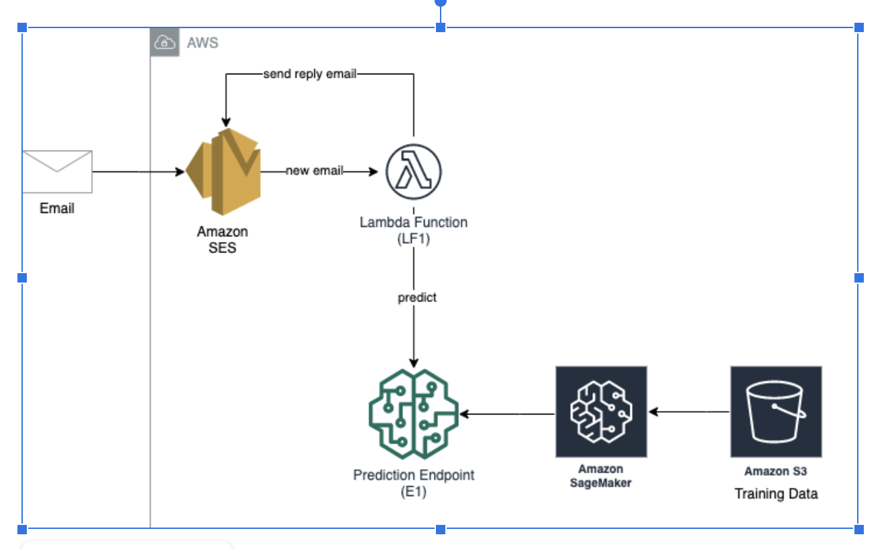

AWS Spam Detection 

A machine learning model to predict whether a message is spam or not. A system that upon receipt of an email message, it will automatically flag it as spam or not, based on the prediction obtained from the machine learning model.  		

